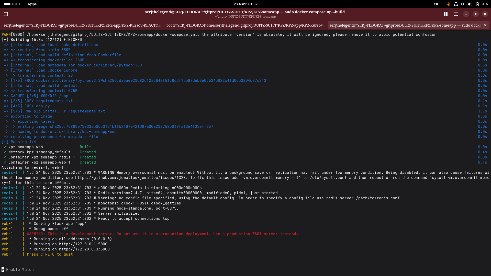
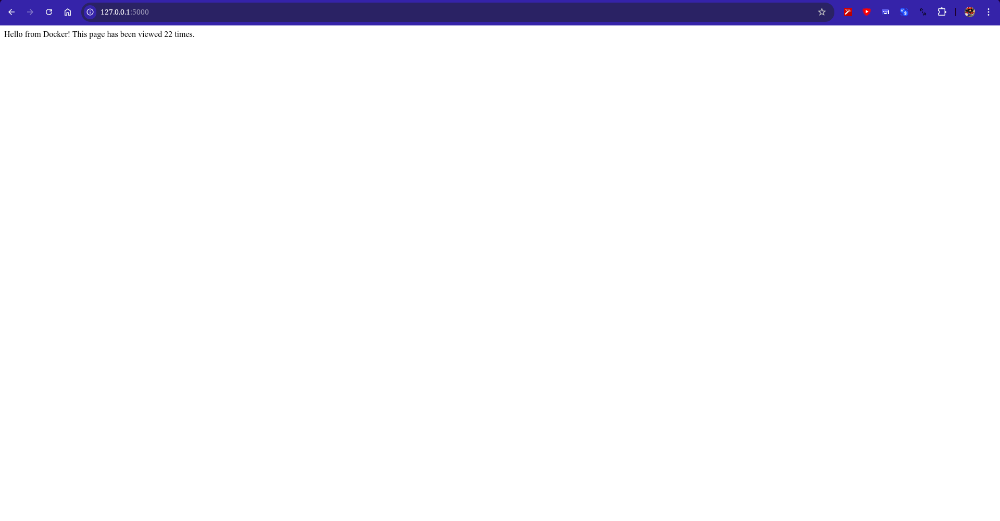
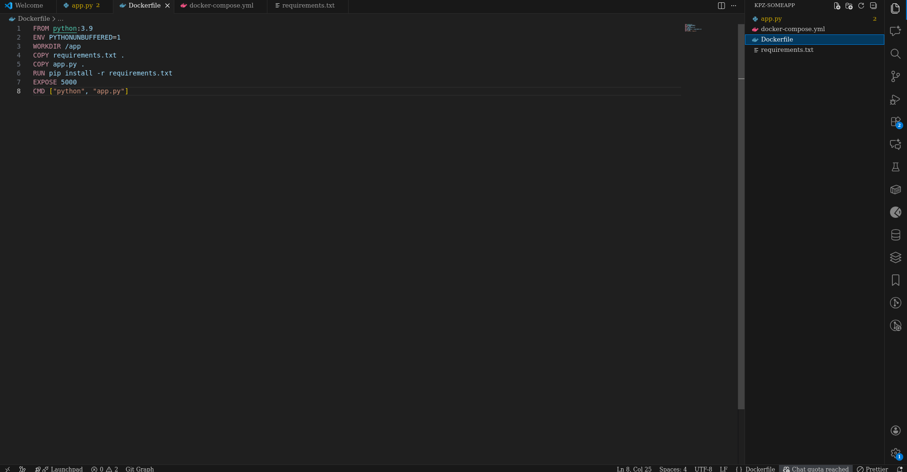

<h1>Workshop 10 — Робота з Dockerfile та Docker Compose</h1>

<h2>Мета</h2>

Навчитися працювати з директивами Dockerfile і запускати багатосервісний застосунок (Flask + Redis) за допомогою Docker Compose.

<h2>Демонстрація роботи</h2>

Нижче наведено скріншоти, які підтверджують коректну роботу запитів.

  
  
  
  

<h1>Висновок</h1>

Впродовж цієї практичної роботи я навчився працювати з директивами Dockerfile і запускати багатосервісний застосунок (Flask + Redis) за допомогою Docker Compose.

