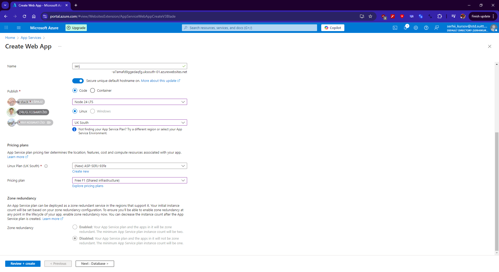
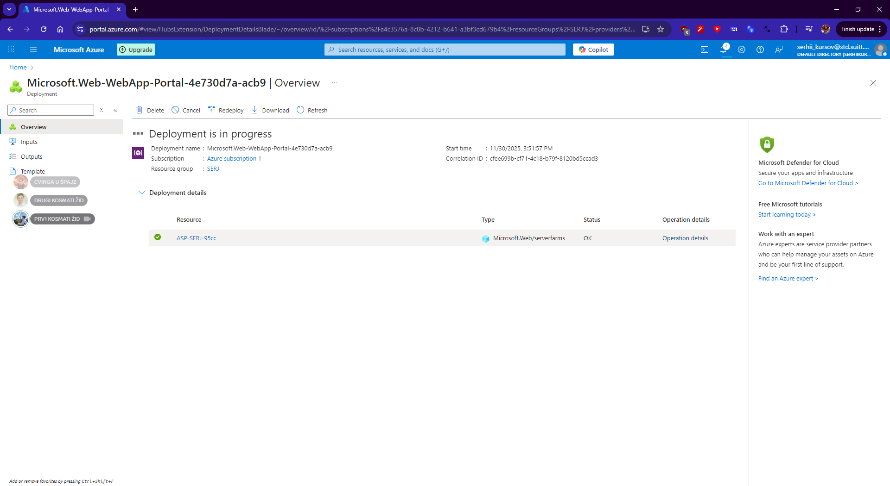
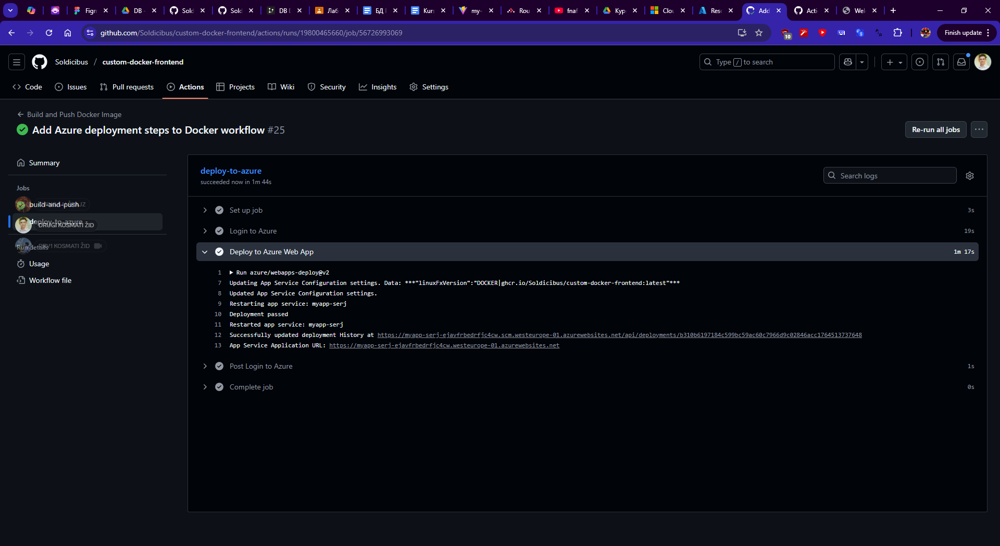
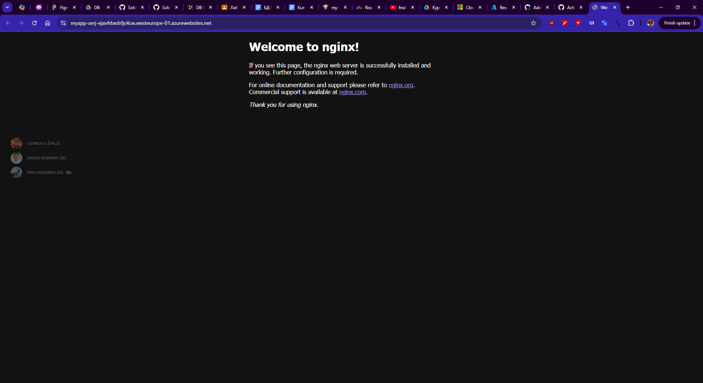
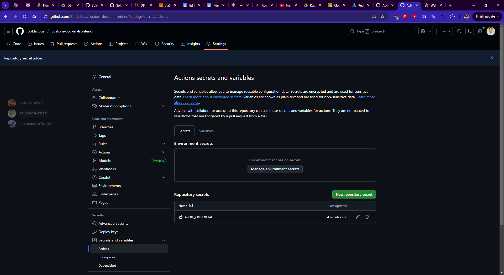

<h1>Workshop — Неперервна доставка (Continuous Delivery)</h1>

<h2>Тема</h2>

Неперервна доставка

<h2>Мета роботи</h2>

Ознайомитися з принципами і практиками неперервної доставки,
сформувати навички роботи з хмарними сервісами Microsoft Azure,
налаштувати автоматизований процес розгортання веб-застосунку
з використанням GitHub Actions, Docker та Azure App Service.

<h2>Теоретичні відомості</h2>

Неперервна доставка (Continuous Delivery) — це підхід до розробки
програмного забезпечення, який забезпечує автоматичну підготовку коду
до розгортання в будь-який момент. Основна ідея полягає в тому, що
кожна зміна в коді після проходження всіх тестів та етапів збірки
готова до публікації на сервері.

Для реалізації неперервної доставки використовуються системи
автоматизації процесів, такі як GitHub Actions, хмарні платформи
(Azure, AWS, Google Cloud) та технології контейнеризації (Docker).
Вони дозволяють значно зменшити кількість ручних операцій, прискорити
випуск нових версій застосунку та зменшити кількість помилок.

<h2>Хід роботи</h2>
<ol>
  <li>Було створено репозиторій на GitHub із фронт-енд застосунком.</li>
  <li>Розроблено Dockerfile для контейнеризації застосунку.</li>
  <li>Налаштовано GitHub Actions workflow для автоматичної збірки
      Docker-образу та його публікації в GitHub Container Registry (GHCR).</li>
  <li>У Microsoft Azure створено ресурсну групу та App Service
      із підтримкою деплою контейнерів.</li>
  <li>Було створено обліковий запис Service Principal для безпечного
      доступу GitHub до підписки Azure.</li>
  <li>Налаштовано автоматичний деплой Docker-образу до Azure App Service.</li>
  <li>Після виконання job’ів отримано посилання на веб-застосунок,
      який успішно відображається у браузері.</li>
</ol>

<h2>Демонстрація роботи</h2>

Нижче наведено скріншоти, які підтверджують коректну роботу налаштованої системи неперервної доставки.

  
  
  
  
  

<h2>Висновок</h2>

Впродовж виконання цієї практичної роботи я ознайомився з принципами
неперервної доставки та на практиці налаштував автоматизований процес
розгортання веб-застосунку. Я навчився створювати ресурсну групу
та App Service у Microsoft Azure, працювати з контейнерами Docker,
створювати Service Principal для безпечної авторизації та
налаштовувати GitHub Actions для автоматичної збірки і деплою.
Отримані знання та навички дозволяють мені ефективно застосовувати
підхід неперервної доставки у майбутніх програмних проєктах.

