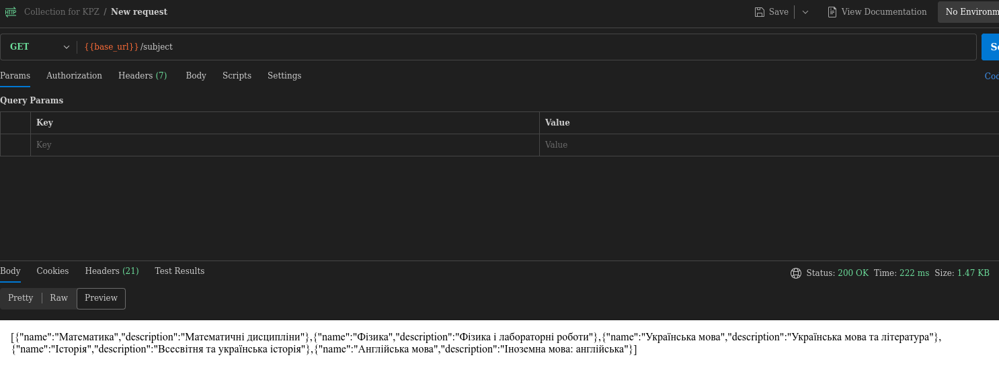
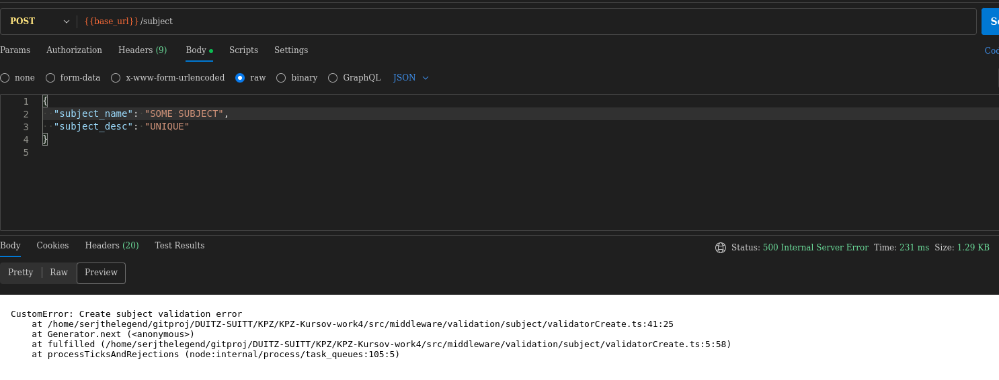
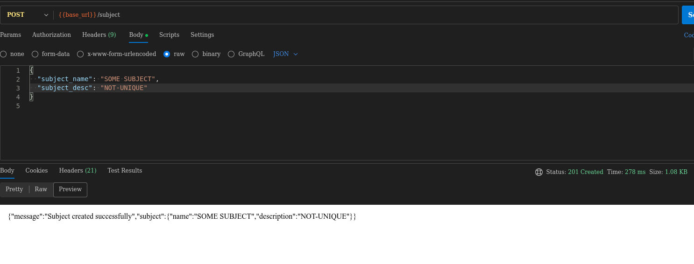

<h1>Workshop 6 — Впровадження сервісного шару, валідації та DTO</h1>

Middleware відповідає за перевірку та валідацію даних, що надходять у запиті. Він відсікає некоректні або небезпечні дані ще до їх обробки. Це дозволяє централізовано реалізувати правила безпеки та узгодженості.  

Controller приймає запит від клієнта та визначає, які сервіси потрібно викликати. Він координує взаємодію між різними шарами системи. Також формує відповідь у потрібному форматі та повертає її клієнту.  

Service містить основні правила та алгоритми роботи системи. Він виконує обробку даних відповідно до вимог бізнесу. Цей шар ізолює бізнес-логіку від деталей збереження чи представлення даних.  

Repository відповідає за доступ до джерел даних, таких як база даних чи зовнішні API. Він інкапсулює операції читання та запису, щоб інші шари не залежали від конкретної реалізації. Це забезпечує гнучкість і спрощує підтримку системи.

<h1>Прклад DTO, Сервісу та валідатора</h1>

<h2>SubjectDTO</h2>
// src/dto/SubjectResponseDTO.ts
import { Subject } from "../orm/entities/Subject/Subject";

export class SubjectResponseDTO {
  name: string;
  description?: string;

  constructor(subject: Subject) {
    this.name = subject.subject_name;
    this.description = subject.subject_desc;
  }
}
 

<h2>SubjectService</h2>
  import { AppDataSource } from "database/data-source";
  import { Subject } from "../orm/entities/Subject/Subject";
  
  export class SubjectService{
      private subjectRepo = AppDataSource.getRepository(Subject);
  
      async createSubject(data: {
          subject_name: string;
          subject_desc?: string;
      }) {
          const { subject_name, subject_desc } = data;
  
          if (!subject_name) {
              throw new Error("Missing required field: subject_name");
          }
  
          const subjectEntity = this.subjectRepo.create({
              subject_name,
              subject_desc,
          });
  
          await this.subjectRepo.save(subjectEntity);
          return subjectEntity;
      }
  
      async getAllSubjects() {
          return await this.subjectRepo.find();
      }
  
      async getSubjectById(subjectName: string) {
          const subjectEntity = await this.subjectRepo.findOne({ 
              where: { subject_name : subjectName }, 
          });
          if (!subjectEntity) throw new Error(`Subject with name ${subjectName} not found`);
          return subjectEntity;
      }
  
      async updateSubject(
          subjectName: string,
          data: {
              subject_name?: string;
              subject_desc?: string;
          }
      ) {
          const subjectEntity = await this.subjectRepo.findOne({ where: { subject_name: subjectName }});
          if (!subjectEntity) throw new Error(`Subject with name ${subjectName} not found`);
  
          Object.assign(subjectEntity, data);
          await this.subjectRepo.save(subjectEntity);
          return subjectEntity;
      }
  
      async deleteSubject(subjectName: string) {
          const subjectEntity = await this.subjectRepo.findOne({ where: { subject_name: subjectName }});
          if (!subjectEntity) throw new Error(`Subject with name ${subjectName} not found`);
          await this.subjectRepo.remove(subjectEntity);
          return subjectEntity;
      }
  }
 

<h2>validation/subject/validatorCreate.ts</h2>
import { Request, Response, NextFunction } from 'express';
import { AppDataSource } from "database/data-source";

import { Subject } from '../../../orm/entities/Subject/Subject';
import { CustomError } from 'utils/response/custom-error/CustomError';
import { ErrorValidation } from 'utils/response/custom-error/types';

export const validatorCreate = async (req: Request, res: Response, next: NextFunction) => {
  let { subject_name, subject_desc } = req.body;

  subject_name = (subject_name || "").trim();
  subject_desc = (subject_desc || "").trim();

  const errorsValidation: ErrorValidation[] = [];
  const subjectRepository = AppDataSource.getRepository(Subject);

  subject_name = !subject_name ? '' : subject_name;
  subject_desc = !subject_desc ? '' : subject_desc;

  if (subject_name.trim() === '') {
    errorsValidation.push({ subject_name: 'Subject name is required' });
  } else if (subject_name.length > 30) {
    errorsValidation.push({ subject_name: 'Subject name must be 30 characters or less' });
  }

  if (subject_desc && subject_desc.length > 0) {
    const descExists = await subjectRepository.findOne({ where: { subject_desc } });
    if (descExists) {
      errorsValidation.push({ subject_desc: 'Subject description must be unique' });
    }
  }

  if (subject_name) {
    const exists = await subjectRepository.findOne({ where: { subject_name } });
    if (exists) {
      errorsValidation.push({ subject_name: `Subject with name '${subject_name}' already exists` });
    }
  }

  if (errorsValidation.length !== 0) {
    const customError = new CustomError(400, 'Validation', 'Create subject validation error', null, null, errorsValidation);
    return next(customError);
  }
  return next();
};

export default validatorCreate;
 

<h2>3. Демонстрація роботи API (Postman)</h2>

Нижче наведено скріншоти із Postman

<h3>DTO GET</h3>

  

<h3>Validation error and success</h3>

  
  

