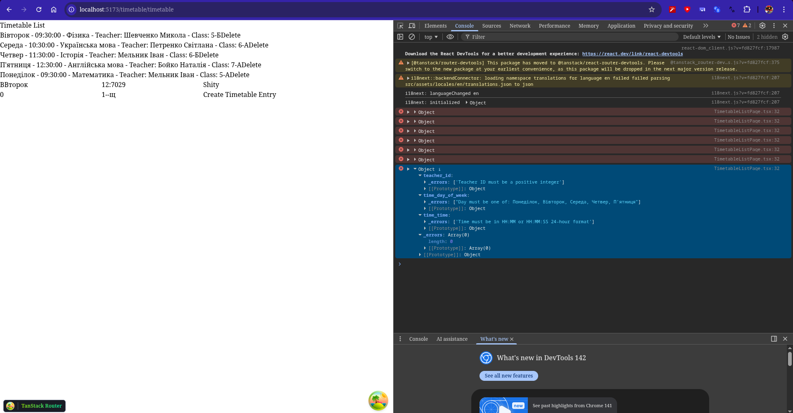
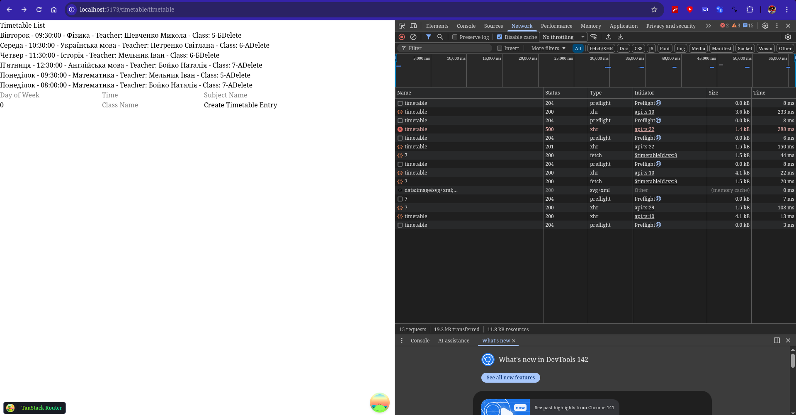
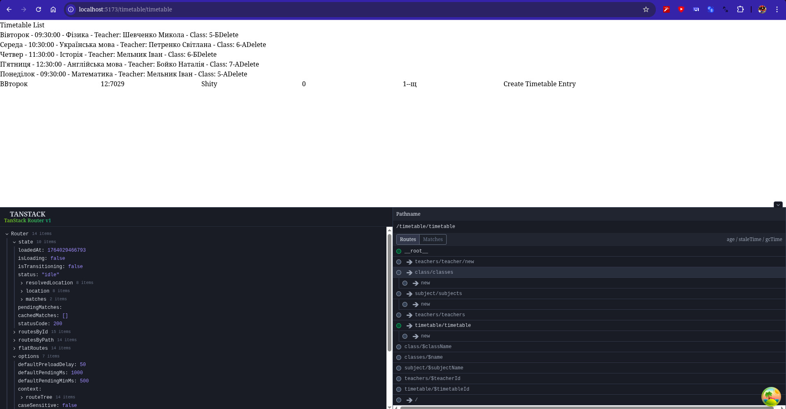

<h1>Workshop 8-9 — Full-stack інтеграція: розробка UI на базі професійного бойлерплейту</h1>

<h2>Короткий опис реалізованих функцій</h2>

  У межах завдання було створено front-end додаток до вже існуючого back-end, реалізовані CRUD запити для основних сутностей, використовуючи всі вимоги від завдання.

<h2>Приклади коду:</h2>

Axios:
 
import axios from 'axios';

const apiClient = axios.create({
	baseURL: import.meta.env.VITE_API_BASE_URL,
	headers: {
		'Content-Type': 'application/json',
	},
});

const token = import.meta.env.VITE_API_AUTH_TOKEN;
if (token) {
	apiClient.defaults.headers.common['Authorization'] = `Bearer ${token}`;
}

apiClient.interceptors.response.use(
	(response) => response,
	(error) => {
		console.error('API Error:', error.response?.data || error.message);
		return Promise.reject(error);
	}
);
export default apiClient;
 
Хуки на прикладі Timetable:
 
// ---------- ХУКИ REACT QUERY ----------

// Хук для отримання всього розкладу
export const useTimetable = () =>
  useQuery<Timetable[], Error>({ queryKey: ['timetable'], queryFn: getTimetable });

// Хук для отримання запису розкладу за ідентифікатором
export const useTimetableById = (id: number) => {
  return useQuery<Timetable, Error>({ queryKey: ['timetable', id], queryFn: () => getTimetableById(id), enabled: !!id });
};

// Хук для створення запису розкладу  
export const useCreateTimetableEntry = (): UseMutationResult<Timetable, unknown, TimetableInput, unknown> => {
  const queryClient = useQueryClient();
  const navigate = useNavigate();

  return useMutation<Timetable, unknown, TimetableInput, unknown>({
    mutationFn: createTimetableEntry,
    onSuccess: async (created) => {
      await queryClient.invalidateQueries({ queryKey: ['timetable'] });
      if (created) {
        // navigate to the newly created timetable entry detail
        await navigate({ to: `/timetable/${created.time_id}` as string });
      }
    },
  });
};

// Хук для оновлення запису розкладу
export const useUpdateTimetableEntry = (): UseMutationResult<Timetable, unknown, { id: number; data: Partial<TimetableInput>; }, unknown> => {
  const queryClient = useQueryClient();

  return useMutation<Timetable, unknown, { id: number; data: Partial<Timetable>; }, unknown>({
    mutationFn: updateTimetableEntry,
    onSuccess: async (_, variables) => {
      await queryClient.invalidateQueries({ queryKey: ['timetable', variables.id] });
      await queryClient.invalidateQueries({ queryKey: ['timetable'] });
    },
  });
};

// Хук для видалення запису розкладу
export const useDeleteTimetableEntry = (): UseMutationResult<void, unknown, number, unknown> => {
  const queryClient = useQueryClient();
  
  return useMutation<void, unknown, number, unknown>({
    mutationFn: deleteTimetableEntry,
    onSuccess: async (data, id) => {
      await queryClient.invalidateQueries({ queryKey: ['timetable'] });
    },
  });
};
 
Схема Zod
 
import { z } from "zod";

const DAYS = ['Понеділок', 'Вівторок', 'Середа', 'Четвер', "П'ятниця"] as const;

export const timetableSchema = z.object({
  time_day_of_week: z.enum(DAYS, {
    message: `Day must be one of: ${DAYS.join(', ')}`
  }),
  time_time: z.string().regex(/^([01]\d|2[0-3]):[0-5]\d(:[0-5]\d)?$/, {
    message: 'Time must be in HH:MM or HH:MM:SS 24-hour format'
  }),
  class_name: z.string().min(1, { message: 'Class name is required' }),
  subject_name: z.string().min(1, { message: 'Subject name is required' }),
  teacher_id: z.number().int().positive({ message: 'Teacher ID must be a positive integer' }),
});
 

<h2>Демонстрація роботи </h2>

Нижче наведено скріншоти із Браузеру, які показують роботу додатку.

  
  
  
  

 
<h1>Висновок</h1>

На протязі цієї лабораторної роботи, я навчився як це бути Full-stack developer. Дізнався про хуки, Zod схеми як валідацію та створення CRUD запитів з-за допомогою TanStack Router.

